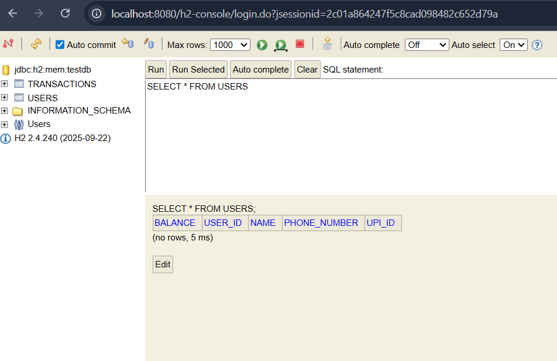
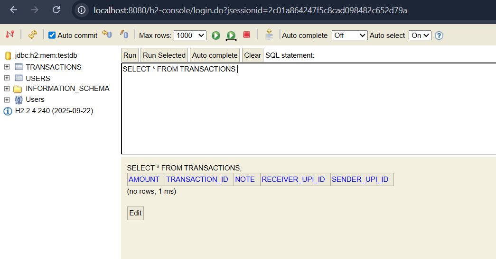
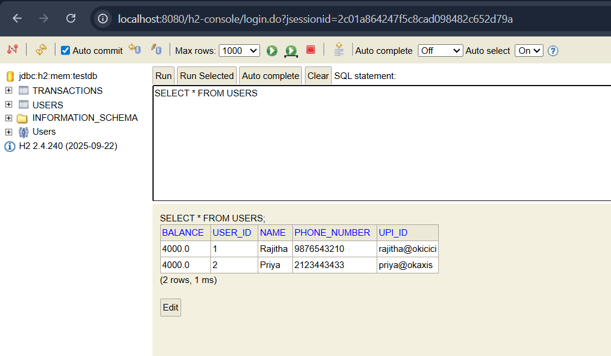
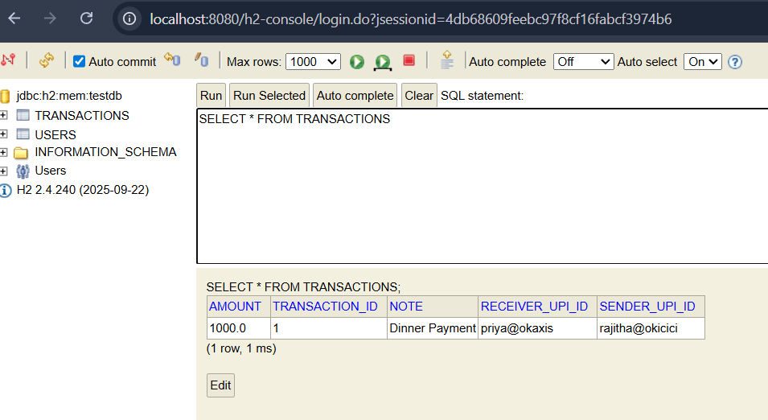

# PayFlow Backend API

PayFlow is a simplified UPI‑style backend built with Spring Boot. It provides REST endpoints for registering users, looking them up, listing all users, and recording transactions between them.

There is no frontend — everything is tested via HTTP calls (`curl`, PowerShell `Invoke-RestMethod`, or Postman) and verified in the H2 in‑memory database.

---

## 🚀 How to Run the App

- Clone or open the project in IntelliJ IDEA or your preferred IDE.
- Ensure you have **Java 17+** and **Maven** installed.
- Run the application:
```bash
mvn spring-boot:run
```
- Access endpoints:
    - Users: http://localhost:8080/users
    - Transactions: http://localhost:8080/transactions
- Open the H2 console at:
    - URL: http://localhost:8080/h2-console
    - JDBC URL: jdbc:h2:mem:testdb
    - User: sa
    - Password: (leave blank)

## 🏗️ Project Layers

- Entity Layer
  - Defines the database tables.
  - User: userId, name, upiId, balance, phoneNumber
  - Transaction: transactionId, senderUpiId, receiverUpiId, amount, note
- Service Layer
  - Business logic layer.
  - UserService: register, get by ID, get all, find by UPI ID, find users with balance above threshold.
  - TransactionService: record transactions.
- Controller Layer
    - REST endpoints.
    - UserController: /users, /users/{id}, /users/upi/{upiId}, /users/balance/{amount}
    - TransactionController: /transactions

## ⚙️ Spring Boot Features in PayFlow
- Embedded server
    - PayFlow runs directly on an embedded Tomcat server.
    - No external deployment needed — just run the app and endpoints are live at localhost:8080.
- Auto‑configuration
    - Spring Boot automatically configures H2, JPA, and Hibernate.
    - No XML or manual datasource setup — tables are created from your entity classes.
- Production‑ready defaults
    - Features like sensible error handling, actuator endpoints, and spring.jpa.show-sql=true are enabled by default.
    - PayFlow behaves like a real backend service without extra setup.

## 📊 Database Tables (Before Data Inserted)

### Users Table


### Transactions Table

*Notice the schema is created but no rows exist yet.*
---

## 📊 Database Tables (After Data Inserted)

### Users Table (After Inserts)

*Rajitha and Priya are inserted — balances reflect initial values.

### Transactions Table (After Inserts)

*Shows the Dinner payment transaction between Rajitha and Priya.

## 🧪 Example Usage
- Register Users
```bash
Invoke-RestMethod -Uri "http://localhost:8080/users" `
  -Method POST `
  -Body '{"name":"Rajitha","upiId":"rajitha@okicici","balance":5000,"phoneNumber":"9876543210"}' `
  -ContentType "application/json"
  
Invoke-RestMethod -Uri "http://localhost:8080/users" `
  -Method POST `
  -Body '{"name":"Priya","upiId":"priya@okaxis","balance":3000,"phoneNumber": "2123443433"}' `
  -ContentType "application/json"
```
- Get All Users
```bash
Invoke-RestMethod -Uri "http://localhost:8080/users" -Method GET
```
- Get User by userId
```bash
Invoke-RestMethod -Uri "http://localhost:8080/users/1" -Method GET 
```
- Get User by UPI ID
```bash
Invoke-RestMethod -Uri "http://localhost:8080/users/upi/rajitha@okicici" -Method GET
```
- Get Users with Balance Above 3000
```bash
Invoke-RestMethod -Uri "http://localhost:8080/users/balance/3000" -Method GET
```
- Record a Transaction (Send Money)
```bash
Invoke-RestMethod -Uri "http://localhost:8080/transactions" `
  -Method POST `
  -Body '{"senderUpiId":"rajitha@okicici","receiverUpiId":"priya@okaxis","amount":1000,"note":"Dinner payment"}' `
  -ContentType "application/json"
```
- Get All Users to Verify Balances
```bash
Invoke-RestMethod -Uri "http://localhost:8080/users" -Method GET
```
- Explanation
    - (a) How JPA derives it from the method name
        - JPA parses the method name findByUpiId.
        - findBy tells JPA this is a query method.
        - UpiId matches the entity field upiId.
        - JPA builds a WHERE clause on that column.
        - Result: a SELECT query filtering by upi_id.
    - (b) What the ? placeholder means
        - The ? is a parameter placeholder in the prepared SQL statement.
        - At runtime, JPA replaces ? with the actual value you pass in (e.g., "rajitha@okicici")
        - This prevents SQL injection and allows efficient query caching.

- Example Call
```java
Invoke-RestMethod -Uri "http://localhost:8080/users/upi/rajitha@okicici" -Method GET
```
- Response:
```java
{
    "userId": 1,
    "name": "Rajitha",
    "upiId": "rajitha@okicici",
    "balance": 5000.0,
    "phoneNumber": "9876543210"
}
```
## 🔍 Custom Query: findByUpiId (Derived Method)

```java
User findByUpiId(String upiId);
```

- Spring Data JPA generates:
```Sql
select u.user_id, u.name, u.upi_id, u.balance, u.phone_number
from users u
where u.upi_id = ?
```
- How JPA derives it:
    - Parses method name findByUpiId.
	- findBy → query method, UpiId → entity field.
	- Builds WHERE clause on upi_id.
- What ? means:
	- Parameter placeholder in prepared SQL.
	- Replaced at runtime with actual value (e.g., "rajitha@okicici").
	- Prevents SQL injection and enables caching.

- Example Call
```Powershell
Invoke-RestMethod -Uri "http://localhost:8080/users/balance/3000" -Method GET
```
- Response:
```json
[
  {
    "userId": 1,
    "name": "Rajitha",
    "upiId": "rajitha@okicici",
    "balance": 5000.0,
    "phoneNumber": "9876543210"
  }
]
```

## 🔍 Custom Query: findUsersWithBalanceAbove (JPQL)
```java
@Query("SELECT u FROM User u WHERE u.balance > :amount")
List<User> findUsersWithBalanceAbove(@Param("amount") Double amount);
```
Spring Data JPA translates JPQL into SQL:
```Sql
select u.user_id, u.name, u.upi_id, u.balance, u.phone_number
from users u
where u.balance > ?
```
- Explanation
    - How JPQL works
		- Written in terms of entity fields (User, balance).
		- JPA converts to SQL targeting the users table.

	- What ? means:
		- Placeholder replaced at runtime with actual value (e.g., 3000).
		- Ensures safe binding and prevents SQL injection.

- Example Call
```Powershell
Invoke-RestMethod -Uri "http://localhost:8080/users/balance/3000" -Method GET
```
- Response:
```json
[
  {
    "userId": 1,
    "name": "Rajitha",
    "upiId": "rajitha@okicici",
    "balance": 5000.0,
    "phoneNumber": "9876543210"
  }
]
```
### Dependency Injection with @Autowired

In both `UserService` and `TransactionService`, the respective repositories are injected using `@Autowired`.

At startup, Spring Boot:
- Scans the classpath for `@Repository` classes.
- Creates beans (managed objects) for them.
- Wires those beans into the `@Autowired` fields in the service classes.

This is called **Dependency Injection**. It means you don’t manually instantiate `UserRepository` or `TransactionRepository`; Spring Boot does it for you, ensuring loose coupling and easier testing.

📜 Curl / PowerShell Commands and Outputs
To demonstrate the API in action, here are sample calls and their responses captured from PowerShell:

# Register User Rajitha
```
Invoke-RestMethod -Uri "http://localhost:8080/users" `
  -Method POST `
  -Body '{"name":"Rajitha","upiId":"rajitha@okicici","balance":5000,"phoneNumber":"9876543210"}' `
  -ContentType "application/json"
```
# Response
```
balance     : 5000.0
name        : Rajitha
phoneNumber : 9876543210
upiId       : rajitha@okicici
userId      : 1
```
# Register User Priya
```
Invoke-RestMethod -Uri "http://localhost:8080/users" `
  -Method POST `
  -Body '{"name":"Priya","upiId":"priya@okaxis","balance":3000,"phoneNumber":"2123443433"}' `
  -ContentType "application/json"
```
# Response
```
balance     : 3000.0
name        : Priya
phoneNumber : 2123443433
upiId       : priya@okaxis
userId      : 2
```
# Get All Users
```
Invoke-RestMethod -Uri "http://localhost:8080/users" -Method GET
```
# Response
```
balance     : 5000.0
name        : Rajitha
phoneNumber : 9876543210
upiId       : rajitha@okicici
userId      : 1

balance     : 3000.0
name        : Priya
phoneNumber : 2123443433
upiId       : priy@okaxis
userId      : 2
```
# Record a Transaction (Send Money)
```
Invoke-RestMethod -Uri "http://localhost:8080/transactions" `
  -Method POST `
  -Body '{"senderUpiId":"rajitha@okicici","receiverUpiId":"priya@okaxis","amount":1000,"note":"Dinner Payment"}' `
  -ContentType "application/json"
```
# Response
```
amount        : 1000.0
note          : Dinner Payment
receiverUpiId : priya@okaxis
senderUpiId   : rajitha@okicici
transactionId : 1
```
# Verify Balances After Transaction
```
Invoke-RestMethod -Uri "http://localhost:8080/users" -Method GET
```
# Response
```
balance     : 4000.0
name        : Rajitha
phoneNumber : 9876543210
upiId       : rajitha@okicici
userId      : 1

balance     : 4000.0
name        : Priya
phoneNumber : 2123443433
upiId       : priya@okaxis
userId      : 2
```